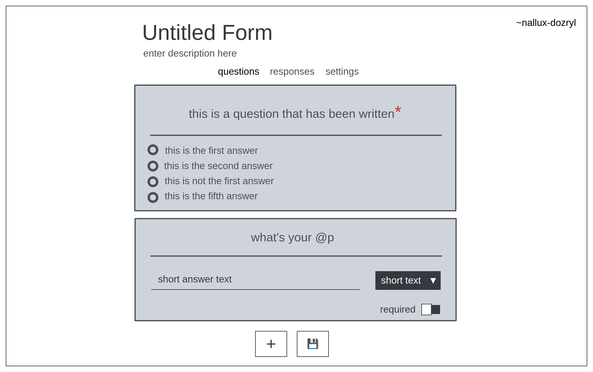

# Urbit Forms
Create forms and surveys with multiple question types.

## Introduction
This document will be split into 2 parts. The agent, which is the hoon code and
 the view, the glob for displaying the app.  

I have made the decision to work mostly in json, including the state, as this is the easiest
 way to keep the front end and back end as similar as possible. 

In its state, there are no separation between your own surveys and surveys you have received from
 other people. Instead, we put the author of the survey along side the survey itself. This also
 applies to responses.

## Agent

### Types
On the top level:
- `surveys`: the survey store, all forms goes here.
- `responses`: the response store, all responses goes here.

#### $surveys
This is a map of `author=ship` and a mop of `survey-id` and `survey` sorted by
 `gth`.
```
+$  surveys  (map author ((mop survey-id survey) gth))
```  

#### $responses
This is a mop of `survey-id` and a map of `author` and mop of `response-id` and `response`
 sorted by `gth` sorted by `lth`. *sorry for this description*
```
+$  responses  ((mop survey-id (map author ((mop response-id response) gth))) lth)
```

#### $survey
A survey is a json object containing:
- `title`: `@t -> %s`
- `description`: `@t -> %s`
- `visibility`: `?(%public %private %team) -> %s`
- `slug`: `@ta -> %s`
- `questions`: `((mop question-id question) gth) -> %o`

_**Note:**_ As of right now, %team doesn't do anything. This is for future functionality.

#### $response
A response is a json object containing a mop of `question-id` and `answer` sorted by gth
```
((mop question-id answer) gth) -> %o
```

#### $question
A question is a json object containing:
- `title`: this is the question itself `@t -> %s`
- `options`: these are the choices provided `set -> %a of %s`. If no
 options are required, (text etc), options will be omitted.
- `front`: the component type that gets rendered in the view `@tas -> %s`
- `back`: the type of value the agent accepts for this question `@tas -> %s`
- `required`: whether or not this question is a required question `? -> %b`

#### $answer
An answer is a json object with the back type as the key and the written answer
 as the value.
```
eg. [%o p={[p='noun' q=[%s p='this is my answer']]}]
```

### Actions
All possible actions the agent accepts.

```
+$  action
  $%  [%create title description visibility slug]
      [%delete survey-id]
      [%edit edit]
      [%ask ship survey-id]
      [%respond survey-id question-id answer]
      [%submit ship survey-id response]
  ==
```

#### %create
Creates a new survey.

#### %delete
Deletes a survey from your state.

#### %edit
Edits modifies the state of a survey. Adding, removing or editing
 questions are also part of this same action.

```
+$  edit
  $%  [%title survey-id title]
      [%desc survey-id description]
      [%vis survey-id visibility]
      [%question survey-id q-action]
  ==
```
q-action is defined as follows:
```
+$  q-action
  $%  [%add title options front back required]
      [%del question-id]
      [%mod question-id title options front back required]
  ==
```
_**Note:**_ Modifying a question will delete the question and recreate
 the question. I'm implementing it this way for simplicity. Open for
 comments.

#### %ask
Pokes the author ship to get a survey.

#### %respond
This puts an answer in the response and thus building the final response that will be sent
 to the survey author via %submit

### Updates
Updates are pretty straightforward in this agent. You either send out a `survey` or a `result`.
```
+$  update
  $%  [%survey survey-id survey]
      [%result survey-id result]
  ==
```
_**Note:**_ Result is a noun, this will be used when validation is a thing. Until then, it's just a placeholder.

### Scry Endpoints

#### Survey
1. `/x/surveys/all` - Retrieves all `survey`s in `$surveys`.
2. `/x/surveys/[ship]` - Retrieves all `survey`s authored by the selected ship.
3. `/x/survey/[survey-id]` - Retrieves a specific survey

#### Response
1. `/x/responses/[survey-id]` - Retrieves all responses for a specific form.
2. `/x/responses/[survey-id]/[ship]` - Retrieves all responses from a specific ship for a specific form.

## View

### Home Page

When opening the app, you will be greeted by the homepage. On the topmost of the page,
 there is a search bar. This is for requesting a survey from another ship. Below that,
 the list of all the surveys in your survey store is displayed. Each item displays the
 title of the survey as well as a dropdown arrow. Clicking on the item itself will
 open the survey for responding.  

By clicking on the arrow, you will be presented with edit, respond, delete and clone. If you do not own
 the survey, you will not be able to edit it.


### New Form


```
::::::::::::::::::::::::::
::                      ::
::  GIANT PLACEHOLDER   ::
::                      ::
::::::::::::::::::::::::::
```
## Deliverables and Funding

### Milestone 1 - 1 Star
1. Complete core functionality as laid out above.

### Milestone 2 - 1 Star
1. Improved GUI
2. Validation
3. Multiple editors in one survey
4. Anonymous survey -- Earth facing mirror

## Miscellaneous

### Contact, Issues, Requests, Feedback
`~donpub-datdux/gerhana-network`
